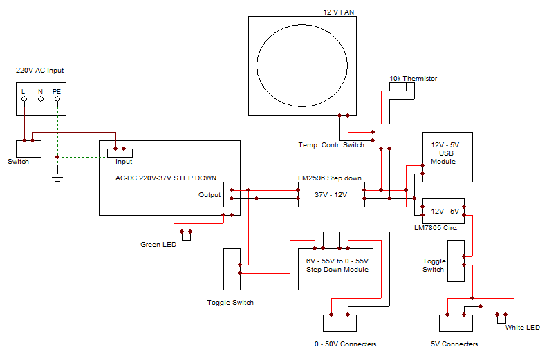

# DIY Benchtop Power Supply

This is a project of designing and assembling a custom laboratory benchtop power supply built inside a repurposed Corsair ATX power supply enclosure. It features an adjustable 0–50V / 5A output stage, auxiliary 5V logic rails, dual 5V USB ports, and an autonomous MOSFET temperature-controlled cooling system.

This is a very fun project in many ways; it felt like an adult version of LEGOs. Side-quest project for my 5DOF robotic arm.

  

---

## Readme Structure

* [What are the necessary components?](#what-are-the-necessary-components)
  * [3D Printed & Mechanical Parts](#3d-printed--mechanical-parts)
  * [Hardware & Tools](#hardware--tools)
  * [Electrical Components](#electrical-components)
* [Connecting All the Components](#connecting-all-the-components)
  * [1. Mains AC Input & Primary Stage](#1-mains-ac-input--primary-stage)
  * [2. Primary Regulated Output (0–50V)](#2-primary-regulated-output-050v)
  * [3. Intermediate 12V Bus](#3-intermediate-12v-bus)
  * [4. Temperature-Controlled Fan Circuit](#4-temperature-controlled-fan-circuit)
  * [5. Fixed 5V Rail & USB Outputs](#5-fixed-5v-rail--usb-outputs)
* [Safety Guidelines](#safety-guidelines)
* [License](#license)

---

## What are the necessary components?

### 3D Printed & Mechanical Parts
* **Enclosure:** Old Corsair ATX power supply case. The original steel chassis provides rigid physical protection, integrated ventilation cutouts, and chassis grounding.
* **Front, Side & Rear Panels:** 3D-printed faceplates (or plywood) designed to mount into the original cable-exit opening of the PSU.
  * *Filament choice:* PETG or ABS/ASA is recommended for heat resistance near internal heatsinks, though PLA works fine if airflow is kept decoupled.
  * *Print settings:* 4 perimeters/walls, 30–40% infill to firmly support tightening binding post nuts.

### Hardware & Tools
* **Soldering Station:** Soldering iron and rosin-core solder wire.
* **Fastening:** Hot glue gun (for wire securing / module standoffs), heat-shrink tubing, and M3 hardware/standoffs.
* **Prototyping:** Perfboard / stripboard for soldering discrete components (fan circuit & 5V regulator).
* **Wiring:** 
  * `14 AWG`: High-current DC path (36V input / 50V output).
  * `20 AWG`: Auxiliary power distribution (12V & 5V rails).
  * `32 AWG`: Low-power signals, LED indicators, and thermistor sense lines.

### Electrical Components

#### Power Modules
* **Primary SMPS:** 180W AC-to-DC step-down power supply board (`100–240V AC` input, `36V 5A DC` output).
* **Main Adjustable DC-DC Module:** Numerical Control Step-Down module (`6–55V` input to `0–50V 5A` output) with digital display and keypad/encoder.
* **Intermediate Step-Down:** LM2596 DC-DC buck converter module (steps down `36V` to `12V`).
* **USB Output Module:** 5V 3A dual USB step-down converter board.
* **Linear Regulator:** LM7805 5V linear voltage regulator in TO-220 package.

#### Cooling & Temperature Control
* **12V Fan:** Stock 12V brushless exhaust fan extracted directly from the Corsair PSU.
* **IRFZ44N N-Channel MOSFET:** Acts as a low-side ground switch for the 12V fan.
* **10k NTC Thermistor:** Attached to the primary SMPS heatsink to monitor operational temperature.
* **10k Variable Resistor:** Trimpot/potentiometer to fine-tune the gate trigger voltage and temperature threshold.

#### Switches, Passives & Connectors
* **Switches:** 
  * `1x` Mains rocker switch (220V AC input).
  * `2x` Dual-position lever toggle switches (one for the 0–50V output rail, one for the 5V rail).
* **Indicators:** 
  * Green LED (indicates active 36V intermediate power).
  * White LED (indicates active 5V output).
* **Capacitors:** `0.33 µF` (input) and `0.1 µF` (output) ceramic/film capacitors for LM7805 stabilization.
* **Terminals:** 4mm banana binding post pairs / DC output jacks.

---

## Connecting All the Components

The system architecture cleanly separates high-voltage input, variable high-power regulation, intermediate power distribution, and thermal management.

  

### 1. Mains AC Input & Primary Stage
* The `220V AC` input enters through an IEC socket and passes through an AC-rated toggle/rocker switch on the Line (L) lead.
* **Protective Earth (PE):** Must be bolted directly to the bare metal of the Corsair chassis with a star washer for shock safety.
* The switched AC lines feed into the **180W AC-DC Step-Down** module, producing an isolated `36V DC` rail.
* A **Green LED** is connected across the 36V output (with an appropriate current-limiting resistor) to serve as the master DC power indicator.

### 2. Primary Regulated Output (0–50V)
* The `36V` positive rail runs through the first dual-position toggle switch before reaching the input of the **Numerical Control 0–50V 5A module**.
* This setup allows isolating and setting up your desired output parameters on the screen before physically enabling power to the front **0–50V Banana Terminals**.

### 3. Intermediate 12V Bus
* In parallel with the main output, the `36V` rail feeds the input of an **LM2596 buck converter**.
* Adjust the onboard trimpot of the LM2596 until its output reads exactly `12.0V DC`. This creates the internal auxiliary power bus.

### 4. Temperature-Controlled Fan Circuit: [Circuit Youtube Link](https://youtu.be/iGzHso3EdJY?si=Qx0kQesTtO12RHpX)
* To keep the bench supply dead-silent during light loads, the Corsair 12V fan is not driven continuously.
* The **10k NTC thermistor** and the **10k variable resistor** form a voltage divider biasing the gate pin of the **IRFZ44N MOSFET**:
  * Drain (D) connects to the negative wire of the 12V fan.
  * Source (S) connects to Ground (GND).
  * The positive wire of the 12V fan connects directly to the `+12V` intermediate rail.
* As temperatures inside the chassis rise, thermistor resistance drops, pulling the gate voltage past $V_{GS(th)}$ and kicking on the fan automatically.

### 5. Fixed 5V Rail & USB Outputs
* The `+12V` intermediate bus supplies two independent 5V stages:
  1. **Dual USB Board:** Stepped down directly from 12V to 5V (3A max) for powering microcontrollers or phone charging.
  2. **LM7805 Linear Stage:** Stepped down from 12V with a `0.33 µF` cap across Pin 1 (IN) and GND, and a `0.1 µF` cap across Pin 3 (OUT) and GND to prevent high-frequency oscillations.
* The linear 5V line passes through the second **toggle switch** out to dedicated **5V binding posts**, accompanied by a **White LED** indicating rail activity.

---

## Safety Guidelines

> ⚠️ **DANGER: HIGH VOLTAGE**  
> * Always double-check that the AC power cord is unplugged before touching internal components.
> * Insulate all AC switch and terminals thoroughly with heat-shrink tubing.
> * Ensure the metal enclosure is reliably grounded to the mains Earth wire (PE).

---

## License

Distributed under the [MIT License](LICENSE). Feel free to build, remix, and use it for your laboratory bench!
