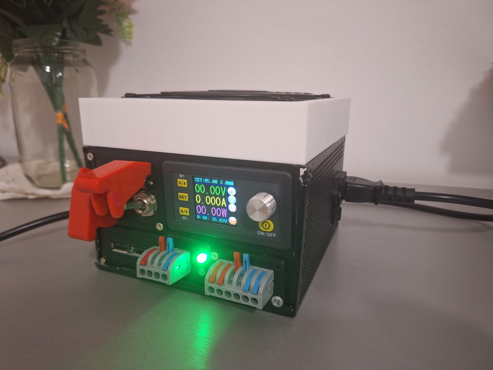

# DIY Benchtop Power Supply

A modular laboratory bench power supply built by repurposing a legacy Corsair ATX power supply enclosure and fan, featuring digitally regulated 0–50V DC output, dedicated 5V fixed rails, dual USB charging, and an autonomous MOSFET-based temperature-controlled cooling system.

<p align="center">
  
</p>

---

### Features
- **Primary Regulated Output:** Digitally controlled `0–50V DC / 0–5A` step-down converter with continuous voltage and current limiting.
- **Auxiliary Fixed Rails:** Regulated `5V DC` via linear stage (LM7805) with panel indicators and toggle isolators.
- **Fast USB Charging:** Dual 5V 3A USB-A ports driven from the internal 12V intermediate rail.
- **Smart Active Cooling:** Autonomous temperature-controlled circuit utilizing an NTC thermistor and an IRFZ44N N-channel power MOSFET to throttle the repurposed 12V Corsair exhaust fan.
- **Upcycled Enclosure:** Rigid metal ATX case with custom 3D-printed / plywood mounting bezels for front-panel controls.

---

## Hardware Architecture

```text
220V AC Input (Mains)
    │
  [AC Mains Switch]
    │
    ▼
[180W AC-DC Step-Down (36V / 5A)] ───────────────► [Green Status LED]
    │
    ├─────────────────────────────► [Toggle Switch] ──► [CNC Buck Module (0-50V 5A)] ──► [0-50V Binding Posts]
    │
    ▼
[LM2596 Buck (36V -> 12V Rail)]
    │
    ├─► [Temp. Controlled Switch (IRFZ44N + 10k NTC)] ──► [12V Corsair Exhaust Fan]
    │
    ├─► [12V to 5V 3A Dual USB Module] ──► [Dual USB Ports]
    │
    └─► [LM7805 Linear Stage] ──► [Toggle Switch] ──► [5V DC Connectors] + [White LED]
